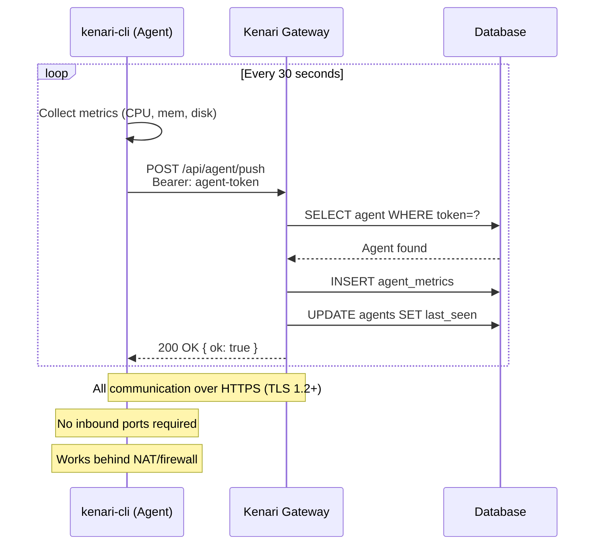

# Kenari Architecture

This document describes the technical architecture of Kenari, the decisions behind it,
and how all components fit together.

---

## Table of Contents

1. [Overview](#1-overview)
2. [Component Map](#2-component-map)
3. [Data Flow](#3-data-flow)
4. [Network Communication — How It Actually Works](#4-network-communication--how-it-actually-works)
5. [Do I Need a Public IP?](#5-do-i-need-a-public-ip)
6. [Technology Decisions](#6-technology-decisions)
7. [Authentication Architecture](#7-authentication-architecture)
8. [Proxy Architecture](#8-proxy-architecture)
9. [Agent Architecture](#9-agent-architecture)
10. [Database Schema](#10-database-schema)
11. [Deployment Targets](#11-deployment-targets)
12. [Security Boundaries](#12-security-boundaries)
2. [Component Map](#2-component-map)
3. [Data Flow](#3-data-flow)
4. [Technology Decisions](#4-technology-decisions)
5. [Authentication Architecture](#5-authentication-architecture)
6. [Proxy Architecture](#6-proxy-architecture)
7. [Agent Architecture](#7-agent-architecture)
8. [Database Schema](#8-database-schema)
9. [Deployment Targets](#9-deployment-targets)
10. [Security Boundaries](#10-security-boundaries)

---

## 1. Overview

Kenari is a **monitoring gateway** — a single authenticated entry point that proxies
access to multiple monitoring tools (Grafana, Uptime Kuma, etc.) while maintaining
a full audit trail of who accessed what and when.

It is designed around three principles:

**Edge-first** — The gateway should run far from the infrastructure it monitors.
If your server is compromised or goes down, the gateway remains accessible and
continues to record events. This is the "canary in a different mine" principle.

**Minimal surface** — The gateway exposes as little as possible. Monitoring tools
run on an internal Docker network with no public ports. Only the gateway is exposed.

**Audit by default** — Every login, logout, and access event is recorded automatically.
No configuration required. The audit log is the foundation for forensic analysis.

---

## 2. Component Map

```
┌─────────────────────────────────────────────────────────────────────┐
│                         PUBLIC INTERNET                              │
└─────────────────────────────────────────────────────────────────────┘
                                  │
                    ┌─────────────▼─────────────┐
                    │      Cloudflare / CDN      │  ← DDoS, WAF, Bot protection
                    └─────────────┬─────────────┘
                                  │ HTTPS
                    ┌─────────────▼─────────────┐
                    │           nginx            │  ← TLS termination, reverse proxy
                    └─────────────┬─────────────┘
                                  │ HTTP (internal)
                    ┌─────────────▼─────────────┐
                    │      Kenari Gateway        │  ← SvelteKit 5, Lucia auth
                    │                            │
                    │  /           Dashboard     │
                    │  /login      Auth          │
                    │  /console    Admin         │
                    │  /agents     Agent mgmt    │
                    │  /status     Public status │
                    │  /settings   User settings │
                    │  /uptime/*   Proxy → Kuma  │
                    │  /grafana/*  Proxy → Graf  │
                    │  /api/agent  Agent API     │
                    └──────┬──────────┬──────────┘
                           │          │
              ┌────────────▼──┐  ┌────▼────────────┐
              │  Uptime Kuma  │  │    Grafana       │
              │  (internal)   │  │   (internal)     │
              └───────────────┘  └─────────────────┘
                           │          │
                    ┌──────▼──────────▼──────┐
                    │    SQLite / Turso DB    │  ← users, sessions, audit, metrics
                    └────────────────────────┘
                                  ▲
                    ┌─────────────┴─────────────┐
                    │      kenari-cli (Rust)     │  ← HIDS agent on monitored hosts
                    │  POST /api/agent/push      │
                    └───────────────────────────┘
```

---

## 3. Data Flow

### User Login (GitHub OAuth)

```
Browser → GET /auth/github
        → Redirect to github.com/login/oauth/authorize
        → User approves
        → GitHub redirects to /auth/github/callback?code=xxx&state=yyy
        → Kenari validates state (CSRF protection)
        → Kenari exchanges code for access token (Arctic library)
        → Kenari fetches user profile from GitHub API
        → Kenari checks whitelist (GITHUB_ALLOWED_USERS / GITHUB_ALLOWED_ORGS)
        → If allowed: create/update user in DB, create Lucia session
        → Set session cookie
        → Redirect to /
        → Audit log: action=login, detail=github oauth, ip=x.x.x.x
```

### Proxy Request (e.g., /uptime/dashboard)

```
Browser → GET /uptime/dashboard (with session cookie)
        → hooks.server.ts validates session via Lucia
        → +server.ts checks locals.user (redirect to /login if null)
        → Audit log: action=access, detail=uptime-kuma, ip=x.x.x.x
        → Fetch upstream: GET http://kenari-kuma:3001/dashboard
          with injected auth headers (X-Kuma-Token: xxx)
        → Stream response back to browser
```

### Agent Metrics Push

```
kenari-cli → POST /api/agent/push
             Authorization: Bearer <agent-token>
             Body: { host_id, timestamp, metrics: { cpu, mem, disk, ... } }
           → Kenari validates Bearer token against agents table
           → Insert into agent_metrics
           → Update agents.last_seen
           → Return { ok: true }
```

---

## 4. Network Communication — How It Actually Works

Ini adalah bagian yang paling sering ditanyakan: **bagaimana agent bisa
mengirim data ke gateway jika keduanya berada di jaringan yang berbeda?**

### Gambaran Besar

```
┌─────────────────────────────────────────────────────────────────────────┐
│                          INTERNET / WAN                                  │
└─────────────────────────────────────────────────────────────────────────┘
         ▲                                          ▲
         │ HTTPS (inbound)                          │ HTTPS (outbound)
         │ port 443                                 │ port 443
         │                                          │
┌────────┴────────────────┐              ┌──────────┴──────────────────┐
│   Kenari Gateway        │              │   Monitored Host            │
│   (Edge / VPS)          │              │   (Server, Pi, Router, etc) │
│                         │              │                             │
│   PUBLIC IP ✅          │              │   NO public IP needed ✅    │
│   domain: monitor.x.com │              │   Behind NAT: OK ✅         │
│                         │              │   Behind firewall: OK ✅    │
│   Receives metrics      │◄─────────────│   kenari-cli PUSHES metrics │
│   from all agents       │   HTTPS POST │   to gateway                │
└─────────────────────────┘   /api/agent │                             │
                               /push     └─────────────────────────────┘
```

### Prinsip Kunci: Push, Bukan Pull

Kenari menggunakan model **push** — agent yang mengirim data ke gateway,
bukan gateway yang mengambil data dari agent.

```
❌ Pull model (TIDAK digunakan Kenari):
   Gateway → "Hei agent, kirim metrics kamu"
   Agent   → "Ini metricsnya"
   
   Masalah: Gateway harus bisa reach agent
            Agent harus punya IP publik atau port forwarding
            Firewall harus dibuka untuk inbound connection

✅ Push model (yang digunakan Kenari):
   Agent   → POST https://monitor.yourdomain.com/api/agent/push
   Gateway → "Terima kasih, data tersimpan"
   
   Keuntungan: Agent hanya butuh akses HTTPS outbound (port 443)
               Tidak perlu IP publik di sisi agent
               Tidak perlu buka port di firewall
               Tidak perlu port forwarding di router
```

### Alur Komunikasi Detail

```
kenari-cli (agent)                    Kenari Gateway
      │                                     │
      │  1. Baca config                     │
      │     ~/.config/kenari/config.toml    │
      │     gateway = "https://..."         │
      │     token   = "abc123..."           │
      │                                     │
      │  2. Kumpulkan metrics               │
      │     CPU, memory, disk, uptime       │
      │                                     │
      │  3. POST /api/agent/push ──────────►│
      │     Authorization: Bearer abc123    │
      │     Content-Type: application/json  │
      │     {                               │
      │       "host_id": "server1",         │
      │       "timestamp": 1776536079,      │
      │       "metrics": {                  │
      │         "cpu_percent": 12.3,        │
      │         "memory_used_mb": 1024,     │
      │         ...                         │
      │       }                             │
      │     }                               │
      │                                     │  4. Validasi token
      │                                     │     SELECT * FROM agents
      │                                     │     WHERE token = 'abc123'
      │                                     │
      │                                     │  5. Simpan ke DB
      │                                     │     INSERT INTO agent_metrics
      │                                     │     UPDATE agents SET last_seen
      │                                     │
      │◄────────────────────────────────────│  6. Response
      │     HTTP 200 { "ok": true }         │
      │                                     │
      │  7. Tunggu N detik (default: 30s)   │
      │                                     │
      │  8. Ulangi dari langkah 2           │
      │                                     │
```

### Diagram Mermaid



### Port yang Dibutuhkan

```
Kenari Gateway (server yang menjalankan gateway):
  INBOUND  443/tcp  ← HTTPS dari browser user dan dari agent
  INBOUND   80/tcp  ← HTTP redirect ke HTTPS
  OUTBOUND  443/tcp → GitHub OAuth, Telegram API

Monitored Host (server yang dimonitor, menjalankan kenari-cli):
  INBOUND   —       ← TIDAK ADA yang dibutuhkan
  OUTBOUND  443/tcp → Kenari Gateway (HTTPS push)

Browser (user yang mengakses dashboard):
  OUTBOUND  443/tcp → Kenari Gateway
```

---

## 5. Do I Need a Public IP?

Pertanyaan yang sangat umum. Jawabannya tergantung pada **peran** masing-masing komponen.

### Kenari Gateway

**Ya, gateway harus bisa diakses dari internet** — baik via IP publik langsung
maupun via domain yang di-resolve ke IP publik.

Opsi deployment gateway:

```
Opsi A: VPS dengan IP publik (paling umum)
  ┌─────────────────────────────────┐
  │  VPS (DigitalOcean, Vultr, dll) │
  │  IP: 1.2.3.4 (publik)          │
  │  Domain: monitor.yourdomain.com │
  │  → A record: 1.2.3.4           │
  └─────────────────────────────────┘

Opsi B: Cloudflare Pages (edge, gratis)
  ┌─────────────────────────────────┐
  │  Cloudflare Pages               │
  │  IP: dikelola Cloudflare        │
  │  Domain: monitor.yourdomain.com │
  │  → CNAME ke pages.dev           │
  └─────────────────────────────────┘
  Catatan: Database harus Turso (remote libSQL)
           karena tidak ada filesystem di edge

Opsi C: Rumah/kantor dengan dynamic IP + Cloudflare Tunnel
  ┌─────────────────────────────────┐
  │  Server lokal (tidak ada IP     │
  │  publik, di balik NAT)          │
  │  + cloudflared tunnel           │
  │  → Cloudflare menangani routing │
  └─────────────────────────────────┘
  Catatan: Gratis untuk personal use
```

### Monitored Host (kenari-cli)

**Tidak, agent TIDAK membutuhkan IP publik sama sekali.**

```
Skenario yang semua bisa jalan:

✅ Server di datacenter dengan IP publik
✅ Server di belakang NAT (IP lokal 192.168.x.x)
✅ Raspberry Pi di jaringan rumah
✅ Router OpenWRT di warnet
✅ Laptop di jaringan kantor
✅ Android di jaringan WiFi
✅ Server di jaringan sekolah tanpa IP publik
✅ Perangkat IoT di jaringan lokal

Syarat satu-satunya: bisa akses HTTPS outbound ke gateway
(port 443 keluar — hampir semua jaringan mengizinkan ini)
```

### Skenario Nyata: Sekolah Tanpa IP Publik

```
Jaringan Sekolah (192.168.1.0/24)
┌─────────────────────────────────────────────────────┐
│                                                      │
│  Server Sekolah          Router/Modem                │
│  192.168.1.10            192.168.1.1                 │
│  ┌──────────────┐        ┌──────────────┐            │
│  │ kenari-cli   │        │ NAT          │            │
│  │              │──────► │              │──► Internet│
│  │ PUSH metrics │        │ port 443 out │            │
│  └──────────────┘        └──────────────┘            │
│                                                      │
└─────────────────────────────────────────────────────┘
                                │
                                │ HTTPS (outbound only)
                                ▼
                    ┌───────────────────────┐
                    │  Kenari Gateway       │
                    │  (Cloudflare Pages    │
                    │   atau VPS)           │
                    │  monitor.sekolah.sch.id│
                    └───────────────────────┘
                                │
                    ┌───────────▼───────────┐
                    │  Dashboard            │
                    │  Diakses guru/admin   │
                    │  dari browser mana pun│
                    └───────────────────────┘
```

### Kenapa Ini Penting untuk Keamanan

Model push dengan gateway di edge bukan hanya soal kemudahan — ini adalah
keputusan keamanan yang disengaja:

```
Jika gateway dikompromis:
  ✓ Attacker TIDAK bisa reach monitored hosts
  ✓ Attacker hanya bisa lihat metrics yang sudah dikirim
  ✓ Attacker tidak tahu IP/lokasi monitored hosts
  ✓ Monitored hosts tetap aman

Jika monitored host dikompromis:
  ✓ Attacker TIDAK bisa reach gateway dari dalam host
    (gateway hanya menerima push, tidak membuka koneksi balik)
  ✓ Attacker bisa stop agent, tapi gateway akan detect "offline"
  ✓ Gateway dan dashboard tetap berjalan normal

Ini adalah prinsip "blast radius minimization" —
kerusakan di satu komponen tidak menjalar ke komponen lain.
```

### SvelteKit 5 (not Next.js, Nuxt, Remix)

SvelteKit compiles to minimal JavaScript with no virtual DOM overhead.
For a monitoring dashboard that needs to be fast on mobile and low-bandwidth
connections, this matters. Svelte 5's runes system (`$state`, `$derived`, `$props`)
provides fine-grained reactivity without the complexity of React hooks.

### Lucia v3 (not better-auth, NextAuth, Auth.js)

The original implementation used `better-auth`, which pulled in `kysely` as a
dependency. `kysely` has ESM circular dependency issues that caused build failures
with Bun's bundler. Lucia v3 is a minimal auth library with zero circular deps,
and it's the same library used in the Digital Lab project — consistency matters.

### Drizzle ORM (not Prisma, TypeORM)

Drizzle generates SQL at build time, not runtime. No reflection, no metadata,
no runtime overhead. The schema is plain TypeScript — readable, versionable,
and works identically with SQLite (local) and libSQL/Turso (edge).

### libSQL / Turso (not PostgreSQL, MySQL)

SQLite is the right database for a single-tenant monitoring gateway.
It requires zero infrastructure, zero connection pooling, and zero maintenance.
For edge deployment, Turso provides a remote libSQL endpoint that's API-compatible
with local SQLite — the same Drizzle schema works for both.

### Rust for kenari-cli (not Go, Python, Node)

| Criterion | Rust | Go | Python | Node |
|-----------|------|----|--------|------|
| Binary size | ~2MB | ~8MB | N/A | N/A |
| Memory (idle) | ~2MB | ~10MB | ~30MB | ~50MB |
| Startup time | <5ms | ~20ms | ~100ms | ~200ms |
| Single binary | ✅ | ✅ | ❌ | ❌ |
| Cross-compile | Excellent | Good | Hard | Hard |

An agent that runs 24/7 on potentially resource-constrained servers (Raspberry Pi,
old VPS, embedded Linux) must be as lightweight as possible. Rust wins on all metrics.

### Tailwind CSS v4 (not CSS modules, styled-components)

Utility-first CSS with zero runtime. Tailwind v4 uses a Vite plugin for
build-time processing — no PostCSS config, no separate build step.

---

## 7. Authentication Architecture

Kenari uses **Lucia v3** for session management with two authentication methods:

### Email/Password

```
Login form → verify password with @node-rs/argon2 (Argon2id)
           → create Lucia session
           → set HttpOnly session cookie
```

Argon2id is the winner of the Password Hashing Competition (2015) and is
recommended by OWASP for password hashing. It is resistant to GPU and
side-channel attacks.

### GitHub OAuth

```
/auth/github → Arctic library generates state + authorization URL
             → User authenticates with GitHub
             → /auth/github/callback validates state, exchanges code
             → Whitelist check (username or email)
             → Create/update user, create session
```

Arctic is a minimal OAuth 2.0 library with no dependencies beyond `fetch`.

### Session Management

Sessions are stored in the `sessions` table with an expiry timestamp.
Lucia automatically:
- Refreshes sessions that are close to expiry (sliding window)
- Invalidates expired sessions on next request
- Creates blank session cookies on logout

### Rate Limiting

Failed login attempts are tracked in `failed_logins` table with IP and timestamp.
If an IP has ≥10 failed attempts in the last 60 seconds, the login endpoint
returns HTTP 429 before even checking credentials.

---

## 8. Proxy Architecture

Kenari proxies requests to upstream tools by:

1. Validating the user session (redirect to `/login` if invalid)
2. Logging the access event to `audit_log`
3. Constructing the upstream URL from the route config
4. Forwarding the request with injected auth headers
5. Streaming the response back to the browser

```typescript
// Simplified proxy handler
const upstreamUrl = `${route.upstreamUrl}/${path}${queryString}`;
const headers = new Headers(request.headers);
headers.set('X-WEBAUTH-USER', 'admin');  // Grafana auth proxy
headers.delete('host');

const response = await fetch(upstreamUrl, {
  method: request.method,
  headers,
  body: request.body,
  duplex: 'half'  // required for streaming request bodies
});

return new Response(response.body, {
  status: response.status,
  headers: response.headers
});
```

### Grafana Auth Proxy

Grafana is configured with `GF_AUTH_PROXY_ENABLED=true` and
`GF_AUTH_PROXY_HEADER_NAME=X-WEBAUTH-USER`. When Kenari proxies a request
to Grafana, it injects `X-WEBAUTH-USER: admin` — Grafana trusts this header
and logs the user in automatically. This means users never see Grafana's own
login page.

### WebSocket Support

Uptime Kuma uses WebSockets for real-time updates. The nginx configuration
includes `Upgrade` and `Connection` headers to support WebSocket proxying.

---

## 9. Agent Architecture

### Push Model (not Pull)

kenari-cli uses a **push model** — the agent sends metrics to the gateway,
not the other way around. This means:

- No inbound ports required on monitored hosts
- Monitored hosts can be behind NAT/firewall
- The gateway never needs to know the host's IP address
- Compromising the gateway does not give access to monitored hosts

### Token Authentication

Each agent has a unique 64-character random token stored in the `agents` table.
The token is presented as a Bearer token in the `Authorization` header.
Tokens can be revoked from the `/agents` page.

### Metrics Collection

kenari-cli uses the `sysinfo` crate to collect:
- CPU usage (global percentage, refreshed every push)
- Memory (used/total in MB)
- Disk (used/total in GB, all mount points summed)
- Uptime (seconds since boot)

### Init System Detection

`kenari doctor` and `kenari agent install` auto-detect the init system by:
1. Reading `/proc/1/comm` (Linux only)
2. Checking for init-specific paths (`/run/systemd/private`, `/sbin/openrc`, etc.)
3. Falling back to `Unknown` if detection fails

Supported init systems: systemd, OpenRC, runit, SysV init, launchd (macOS), Windows SCM.

---

## 10. Database Schema

```sql
-- Authenticated users
CREATE TABLE users (
  id           TEXT PRIMARY KEY,
  email        TEXT NOT NULL UNIQUE,
  name         TEXT NOT NULL,
  password_hash TEXT,           -- NULL for OAuth-only users
  github_id    TEXT UNIQUE,     -- NULL for email-only users
  avatar_url   TEXT,
  role         TEXT NOT NULL DEFAULT 'viewer',  -- 'admin' | 'viewer'
  created_at   INTEGER NOT NULL  -- Unix timestamp ms
);

-- Lucia auth sessions
CREATE TABLE sessions (
  id         TEXT PRIMARY KEY,
  user_id    TEXT NOT NULL REFERENCES users(id),
  expires_at INTEGER NOT NULL
);

-- All security-relevant events
CREATE TABLE audit_log (
  id         INTEGER PRIMARY KEY AUTOINCREMENT,
  user_id    TEXT REFERENCES users(id),  -- NULL for unauthenticated events
  action     TEXT NOT NULL,  -- 'login' | 'logout' | 'access' | 'admin'
  detail     TEXT,           -- e.g. 'github oauth', 'uptime-kuma', 'set role admin'
  ip         TEXT,
  user_agent TEXT,
  created_at INTEGER NOT NULL
);

-- Failed login attempts (for rate limiting and threat detection)
CREATE TABLE failed_logins (
  id         INTEGER PRIMARY KEY AUTOINCREMENT,
  ip         TEXT NOT NULL,
  email      TEXT,           -- The email that was attempted
  created_at INTEGER NOT NULL
);

-- Registered kenari-cli agents
CREATE TABLE agents (
  id         TEXT PRIMARY KEY,  -- slug of the host name
  name       TEXT NOT NULL,
  token      TEXT NOT NULL UNIQUE,  -- 64-char random hex
  last_seen  INTEGER,          -- Unix timestamp ms of last push
  created_at INTEGER NOT NULL
);

-- Time-series metrics from agents
CREATE TABLE agent_metrics (
  id              INTEGER PRIMARY KEY AUTOINCREMENT,
  agent_id        TEXT NOT NULL REFERENCES agents(id),
  cpu_percent     REAL NOT NULL,
  memory_used_mb  REAL NOT NULL,
  memory_total_mb REAL NOT NULL,
  disk_used_gb    REAL NOT NULL,
  disk_total_gb   REAL NOT NULL,
  uptime_secs     INTEGER NOT NULL,
  created_at      INTEGER NOT NULL
);
```

---

## 11. Deployment Targets

| Target | Adapter | Database | Build Command |
|--------|---------|----------|---------------|
| Docker / VPS | `@sveltejs/adapter-node` | SQLite (local file) | `bun run build` |
| Cloudflare Pages | `@sveltejs/adapter-cloudflare` | Turso (remote libSQL) | `bun run build:edge` |
| Development | Vite dev server | SQLite (local file) | `bun run dev` |

The adapter is selected at build time via the `DEPLOY_TARGET` environment variable:

```javascript
// svelte.config.js
const isEdge = process.env.DEPLOY_TARGET === 'cloudflare';
adapter: isEdge ? adapterCloudflare() : adapterNode()
```

---

## 12. Security Boundaries

```
TRUST BOUNDARY 1: Internet → nginx
  - TLS termination
  - DDoS protection (Cloudflare)
  - Rate limiting (nginx limit_req)

TRUST BOUNDARY 2: nginx → Kenari Gateway
  - Session validation (Lucia)
  - GitHub OAuth whitelist
  - Rate limiting (failed login counter)
  - CSRF protection (OAuth state parameter)

TRUST BOUNDARY 3: Kenari Gateway → Upstream Tools
  - Internal Docker network only (no public ports)
  - Auth header injection (Grafana auth proxy)
  - API token injection (Uptime Kuma)

TRUST BOUNDARY 4: kenari-cli → Kenari Gateway
  - Bearer token authentication
  - HTTPS only (TLS 1.2+)
  - Push-only (no inbound ports on monitored hosts)
```

### What Kenari Does NOT Protect Against

- A compromised admin account — if an admin's GitHub account is taken over,
  the attacker can access all monitoring tools
- Server-level compromise — if the host running Kenari is compromised,
  all data including the SQLite database is accessible
- Upstream tool vulnerabilities — Kenari proxies requests but does not
  sanitize or inspect the content of responses from Grafana or Uptime Kuma

These are documented in [SECURITY.md](./SECURITY.md).
